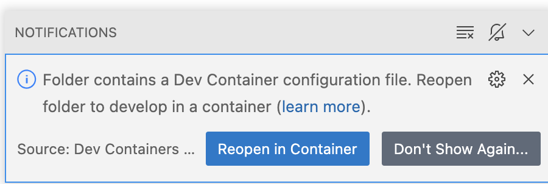

# vscode-playground

📚 Learning and exploring Visual Studio Code (VS Code).


## Overview

With this repository I am trying out Visual Studio Code (abbreviated "VS Code") in detail. In 2022/2023 I explored [VS Code Remote Development](https://code.visualstudio.com/docs/remote/remote-overview)
and my findings are reflected in this repo. In 2025, I'm coming back to get leverage out of VS Code forks, like Cursor,
because the allure is too strong of an AI-enhanced workflow. IntelliJ hasn't caught up yet, so we're going to Cursor.


## Design

This project can be developed in a project-specific *dev container*. The dev container, per convention, is defined in
`.devcontainer/devcontainer.json`. I scaffolded the configuration file using the VS Code command "Dev Containers: Add
Dev Container Configuration Files...".


---
**NOTE:** I suggest NOT using Dev Containers in Cursor. It doesn't seem to be well- (or much at all) supported: <https://github.com/getcursor/cursor/issues/718>.
And that's ok. We need to switch between tools depending on the use-case. I wish there were fewer tools in total, but it
is what it is: IntelliJ for Java/Kotlin development, Cursor for the best AI-enchanced workflow, VS Code as a general-purpose
and good default in many cases.

---

The project defines example programs in various programming languages. By having a polyglot (multi-language) project,
we can showcase the flexibility and power of the Dev Containers specification and implementation. Normally, it's up to the
user to follow multiple sets of "Install toolchain XYZ ..." instructions to prepare their computer with a working development
environment. Alternatively, it's up to a more experienced programmer like a library author or team lead to automate the
development environment setup using long and fragile shell scripts. But with Dev Containers, the experience of the end-user
programmer and the project author is easy. Dev Containers is actually built on top of many lengthy, variegated, shell
scripts! For example, read the [Java `install.sh` script](https://github.com/devcontainers/features/blob/2af02c198adabacff30c400b0bfcad972ce5abcc/src/java/install.sh)
or the [Python one](https://github.com/devcontainers/features/blob/2af02c198adabacff30c400b0bfcad972ce5abcc/src/python/install.sh).
Try to remember that Dev Containers is a layer of abstraction over these gnarly install scripts.


## Instructions

Follow these instructions to get up and running with this project.

1. Attach VS Code to the dev container (skip this if you're using Cursor)
   * When you open VS Code in a project that contains a dev container configuration file (`.devcontainer/devcontainer.json`),
     VS Code will usefully prompt you with a notification like the following.
   * 
   * Click the "Reopen in Container" button and VS Code will start a dev container (Docker container), VS Code will reload
     itself (the screen flashes) in a remote development mode where it attaches to some kind of backend VS Code server
     that's running in the dev container.
   * Now you are ready to start building, running and developing the project because you have a working development
     environment. You don't have to worry about installing Java (OpenJDK) or Gradle.
1. Build and run the example Java program
   * Execute the following command from the built-in VS Code terminal.
   * ```shell
     gradle -p example-java run --args "hello there!"
     ```
   * Gradle will compile and run the program using the JDK installed in the dev container. Altogether, it should look
     something like this.
   * ```text
     vscode ➜ /workspaces/vscode-playground (main ✗) $ gradle -p example-java run --args "hello there!"
     
     > Task :run
     Hello, World! I'm a Java program. I was passed 2 arguments. They are: [hello, there!]
     Bye!
     
     BUILD SUCCESSFUL in 5s
     2 actionable tasks: 2 executed
     ```
1. Build and run the example Go program
   * Execute the following command from the build-in VS Code terminal.
   * ```shell
     (cd example-go; go run .)
     ```
   * The Go toolchain installed in the dev container builds and runs the program. Altogether, it should look something
     like this:
   * ```text
     vscode ➜ /workspaces/vscode-playground (main ✗) $ (cd example-go; go run .)
     "Don't communicate by sharing memory, share memory by communicating."
     ```
   * Note: the command executes in a subshell and `cd`s into the `example-go/` directory because `go run`, unlike most other
     language toolchains, does not have a way to "specify a project in another directory". So we resort to temporarily
     moving into that directory.


## Observations about Visual Studio Code (including Codespaces and Cursor)

* I like VS Code's "launch configurations" (an analog to Intellij's "run configurations") for two reasons. 1) they are
  defined in JSON (and ostensibly I should version control them in Git?) and 2) they simply kick off a command in the
  in-app terminal. It's a very simple model! By contrast, Intellij executes a run configuration in a separate "Run"
  window. While this isn't a major difference, the VS Code model is delightfully "obvious".
* Visual Studio Code is stylized/abbreviated as "VS Code". It's easy to forget the space!
* There is a control struggle with the dev containers experience. When using VS Code in the dev container, I don't have
  my "host system" (VS Code calls these "local") extensions (like GitHub Copilot). Instead, I only have the extensions prescribed in the dev container
  config. I think this makes sense (or am missing something?), because the VS Code "backend" is running in the container,
  right? And it's correct that dev containers shouldn't by default be granted the same trust that your host VS Code is
  granted. For example, a dev container should not be authorized to access the GitHub APIs (like repo permissions,
  Copilot permissions) unless I grant it. So, in other words, the dev container has taken control of the VS Code
  experience (for better and worse). I think dev containers are completely compelling for demo environments (espeically
  Codespaces demos right from the browser!), learning environments, bug reproduction environments, perhaps QA environments,
  etc. But if you're in the same codebase day in and day out, for months or years then I think you might want to take
  back your control.
* Lack of Kotlin support. VS Code has out-of-the-box syntax highlighting for 20+ programming languages. It does
  this by way of a grammar configuration file. For simple languages like Clojure, which is designed to have very few language
  features, [the grammar configuration is rudimentary](https://github.com/microsoft/vscode/blob/main/extensions/clojure/syntaxes/clojure.tmLanguage.json).
  For languages like Groovy, [the grammar configuration is sophisticated](https://github.com/microsoft/vscode/blob/f75d676e8df401c52e10df470970d251380e875a/extensions/groovy/syntaxes/groovy.tmLanguage.json).
  There are configurations for other programming languages: CoffeeScript, C++, C#, CSS, Dart, Dockerfile, Emmet, F#, Go,
  HTML, Java, JavaScript, Julia, LaTeX, Less, Lua, Perl, PHP, PowerShell, Python, R, Ruby, Rust, generic Shell, SQL, Swift,
  and VisualBasic. For many of these languages, VS Code goes above and beyond basic syntax highlighting and supports a
  rich IDE-like language experience with more complete syntax highlighting, smart autocompletion, error checking, jump-to-definition,
  and other features. These rich experiences are powered by [language servers](https://code.visualstudio.com/api/language-extensions/language-server-extension-guide)
  which are installed as VS Code extension. Example language extensions include:
   * [Microsoft owns and develops a Python extension](https://marketplace.visualstudio.com/items?itemName=ms-python.python).
   * [Microsoft owns and develops a C/C++ extension](https://marketplace.visualstudio.com/items?itemName=ms-vscode.cpptools).
   * [Microsoft owns and develops a C# extension](https://marketplace.visualstudio.com/items?itemName=ms-dotnettools.csharp)
   * [RedHat owns and develops a Java extension](https://marketplace.visualstudio.com/items?itemName=redhat.java)
   * [Google owns and develops a Go extension](https://marketplace.visualstudio.com/items?itemName=golang.Go)
   * [An individual owns and generously maintains a Ruby extension](https://marketplace.visualstudio.com/items?itemName=rebornix.Ruby)
   * [An individual owns and generously maintains a Kotlin extension in 'preview'](https://marketplace.visualstudio.com/items?itemName=fwcd.kotlin)
   * [An individual formerly generously maintained a popular Kotlin extension. This is unmaintained for three years](https://marketplace.visualstudio.com/items?itemName=mathiasfrohlich.Kotlin)
  
  It's interesting that there is neither out-of-the-box syntax support for Kotlin nor is there an organization-sponsored
  language extension. JetBrains owns Kotlin so it's reasonable that JetBrains would consider contributing the grammar or
  maintaining a language extension for Kotlin. But of course, JetBrains has a competing IDE product. And to be fair,
  Microsoft could contribute a grammar configuration for Kotlin. That is much less expensive to maintain than a full-on
  language server. This leaves programmers like me in a tough place because I want to use VS Code, dev containers and
  Codespaces for my Gradle-based projects that are using the Gradle Kotlin DSL. I've been using the Kotlin DSL for a few
  years and it is not strategic to go back to the Groovy DSL. What should I do?
* VS Code is a text editor (compared to an IDE) in the same way that React is a library (compared to a framework). They
  have both tremendously overachieved mass adoption and commensurately grown in sophistication and lines-of-code. When
  you compare Sublime Text and VS Code on the "editor-to-IDE" spectrum, Sublime Text inches to the right while VS Code
  leaps to the right. Make a similar comparison between React and Mustache/Handlebars. Be aware of these spectrums of
  low-to-high tooling sophistication. Sometimes we need one tool, and sometimes we need the other. All options have their
  own strengths and weaknesses. Inform yourself the best you can!
* Opening this project in Codespaces technically worked (yay!) but there are hiccups. 1) There was a VS Code notification
  that the Gradle extension failed.
  > The Gradle client was unable to connect. Try re-connecting.

  (Note this issue also happens in the dev container when running locally). After I ran `gradle run` from the terminal,
  this issue was resolved and the Gradle integration was working; the Gradle tasks on the lefthand bar were showing up.
  2) The first `gradle run` tasks too 1 minute and 20 seconds. You can discount 5 seconds because of the sleep statement
  in the program but over a minute is very long! The second `gradle run` was only 8 seconds (perfectly fine). I'm using
  the default 2-core 4GB codespace configuration. Maybe 4GB is just too low for the combination of VS Code (headless
  electron how does that work??) and Gradle (Java) and whatever other Codespace machinery is running. and 3) You need to
  allow cookies in your browser from `vscode-cdn.net` otherwise an error notification shows up in VS Code with a message
  about ServiceWorkers.
* `File: New Untitled File` is an interesting and very different workflow for creating files. First, there is a perfectly
  short keyboard shortcut for it: `Cmd + N`. Next, it brings you to a new empty file with "clickable source text as UI-controls"
  content and you can click the "Select a language" text, then choose your language (I did Markdown for this case). Then
  you can start coding/writing and you don't even have to name the file until you save (which is an interesting trade-off
  to help you focus on content instead of front-loading the naming task). I'm concerned about going back to a "I must save
  manually all the time workflow" compared to Intellij where all files are saved automatically. But this is interesting.
* VS Code has "Outline" which is analogous to the "Structure" view in IntelliJ. The way I use this feature in Intellij
  is mostly via the keyboard shortcut `Cmd + F12` which brings up the "Structure" view and then I use the arrow keys to
  navigate the list of items. In VS Code, the keyboard shortcut is `Cmd + Shift + O` which brings up the "Outline" view
  and then I use the arrow keys to navigate the list of items. (Another jaw dropping moment with GitHub Copilot. Copilot
  auto-completed everything after "VS Code has 'Outline' which is ana". I didn't even write the whole word for "analogous").
  Also, VS Code has the "just start typing" feature which filters down the list of items in the "Outline" view. Intellij
  does this in even more contexts, but VS Code does it well.
* One of my absolute killer feature differentiators that I use in Intellij is cycling through my diff at the speed of
  sound. I do this with a keyboard shortcut to move focus to the VCS tab, then arrow keys to focus on a file, then `Cmd + D`
  to show the diff, then `F7` to cycle through the changes, and `F7` even crosses to the next file. Critically, during my
  diff review, I'll always find something to fix/improve and I just press `F4` which jumps to an editor tab at that line.
  I can't quite get the same effect in VS Code but at least I can cycle through the diff with `Next Change` (`Option + F5`).
* Annoyingly, the keyboard shortcuts to open the sidebar/toolbar things like "Explorer", "Search", "Source Control", etc.
  do not work to hide them. The keyboard shortcuts are not "show/hide" but rather a "show" only. I want to peek at my
  changed files and then hide them again and I can't do that by staying on the keyboard. There has to be another way...
* Chords. `Cmd + R` brings puts you into a chorded mode where the editor is awaiting your next key press. One chord I use
  is `Cmd + R, V` to open the preview pane for a Markdown file. Interesting! I don't dislike modal editors. It gives you
  more "free airspace" for key combos but it does add a level of indirection/complexity. 


## Wish List

This is a list of things I wish to explore, answer and/or implement.

* [ ] Get a Python program working (which build tool?)
* [ ] Get an NPM-based TypeScript program working
* [ ] Create a launch configuration (I have a working one but I haven't explored the feature enough).
* [ ] Describe how to run the project in debug mode.
* [x] DONE (I read the docs; I don't want to redescribe any of that for now) Cursor? Document some observations about the controls and interaction of AI things like auto-completion, inline chat, etc.
  I want to compress the workflow where possible, and get leverage out of the LLM-powered actions.
   * DONE (fixed; had to subscribe to pro) Cursor doesn't have the Copilot-style auto-complate enabled by default. I think it's called Cursor Tab?
* [x] DONE Explore Project Rules.
   * I make a rule for my markdown/README files.
* [ ] Set up a proxy so I can see the types of data coming/going from Cursor. Trying to get a feel for what actions use
  up the quota.


## Finished Wish List Items

* [x] DONE Get a dev container working
* [x] DONE Get a Gradle-based Java program working
* [x] DONE Get a Go program working
  * DONE First, get the Go toolchain installed in the dev container. I need to figure learn about dev container
  "features".
  * DONE Write the program.
* [ ] SKIP (Not possible right now. There is no official dev container "feature" for Swift right now) Get a Swift program working. Swift has a good backing of an official extension. See <https://www.swift.org/blog/vscode-extension/>.
* [x] DONE (It's a bit awkward, but I think that's just the nature of having a split-brain editor/IDE. If some of the IDE
  is on your host/computer and some is on a remote host, then it's complicated by nature. There is a [good explanation in the docs](https://code.visualstudio.com/docs/devcontainers/containers#_managing-extensions))
  What is the interop story between a dev container-powered VS Code experience and "local" extensions? For example, when
  I'm in a dev container project, the dev container might specify that VS Code extensions "A", "B", and "C" are installed.
  But I'm used to my special extension "Z" because it helps me with keyboard shortcuts or accessility or something. Can
  I use "Z" still without editing the shared dev containers config file?
* [x] DONE (Partially answered. The [Dev Containers spec explains](https://containers.dev/implementors/spec/#mounts)
  > "Source code is stored outside of the container so that a developer’s in-flight edits can be extracted, or a new
  > container created in the event a container no longer starts."
  
  So, while it doesn't describe the implementation details, I'm satisfied knowing the "what" and "why" and not "how")
  How are project files shared between my host system and the dev container? I read somewhere that dev containers don't
  use bind mounts, only volumes. Do my file edits in the dev container show up on my host? Or not? And when I have to
  rebuild the dev container, for example to add a new extension, then what happens to my project state, like my file edits?
* [x] NOT POSSIBLE (The Gradle VS Code extension supports Gradle tasks and project detection but when it comes to Kotlin
  language support, that's not its job. See my earlier note about Kotlin language support in VS Code. While the preview
  Kotlin extension maintained by an individual is promising, I will stick with "paved road" tooling). I can't get syntax
  highlighting in the `settings.gradle.kts` or `build.gradle.kts` files even though I'm getting the Gradle tool button
  thing and can run Gradle tasks like "run" successfully. So the Gradle VS Code is partly working. I need syntax
  highlighting and autocomplete for `build.gradle.kts`.
* [x] DONE (It is called "User Settings" and it's backed by a JSON file at `$HOME/Library/Application\ Support/Code/User/settings.json`
  Also, there is an interesting override specific to Markdown that turned word wrap on. I want that off. The raw markdown
  is source code. I'm happy that the *rendered* markdown wraps).
  Can I globally configure preferences in VS Code? I want word wrap always off, for example.
* [x] DONE Updates for 2024
* [x] DONE (they are in `~/Library/Application Support/Cursor/User/keybindings.json`) Where are keyboard shortcuts defined? Not in the same `settings.json` file right?


## Reference

* [Visual Studio docs: *Java in Visual Studio Code*](https://code.visualstudio.com/docs/languages/java)
* [The `Go` language Dev Container *feature*](https://github.com/devcontainers/features/tree/main/src/go)
  * It's interesting that the Dev Container project (which is a *specification*) actually comes with an enormous amount
    of implementation of the specification. For example, the above link is a *feature* (an implementation) for Go. There are
    27 official features (count instances of `ghcr.io/devcontainers/features` on [the Features page](https://containers.dev/features)).
    Usually specifications are backed by either third-party implementations or at least by an implementation that is not
    branded the same as the specification. For example HTML/CSS/ECMAScript are specs and are implemented by the browser vendors
    and by a long tail of other tooling. But by providing a spec and an exhaustive implementation, that's definitely one
    way to boost the adoption of a project.